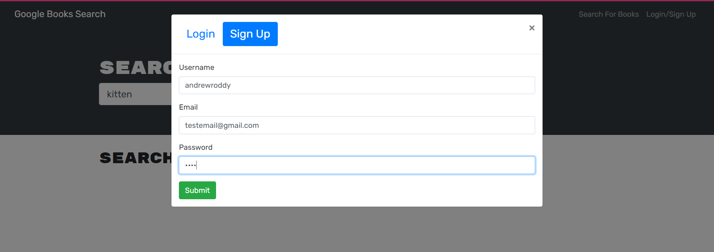
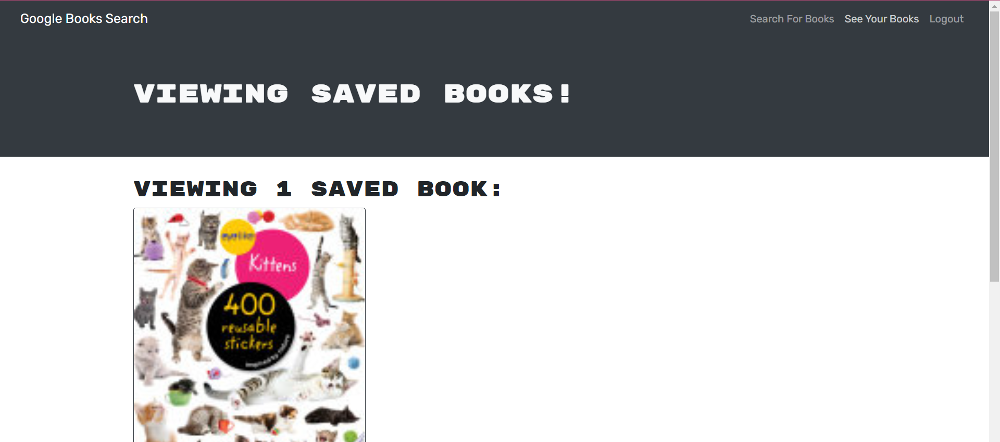

# graphql-book-search

Deployed at https://book-search-aroddy.herokuapp.com/

Application which allows users to authenticate, search for books, saved desired books, and view saved books.

Book search is enabled via Google's Book Search API.

Book save is enabled via MongoDB exposed with Apollo Server and Graphql.

## User Guide

Navigating to the home page, the use is presented with the following screen.

In the top right Nav, the use has the option to either Login or Signup.

After successful signup/login, the user can search for books.

Each book has a "Save Book" button in blue. After clicking "Save Book", he user will be able to view that book by navigating to "See My Books" in the Nav bar.

## Instructions to run locally

1. Run `npm i` to install packages across client and server
2. Run `npm run develop` to start client service and server concurrently

## Contact

Find me on Github at https://github.com/andrewroddy92
